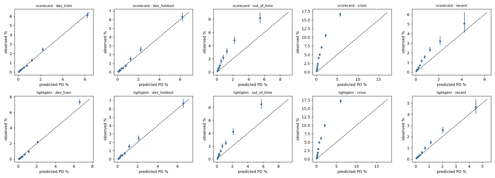
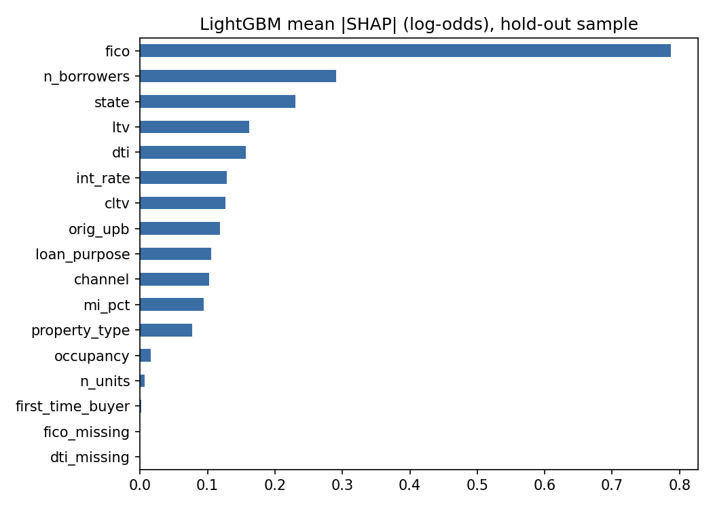
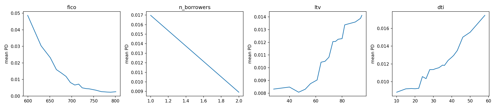

# Independent Validation Report: Mortgage 24-Month PD Models (v1.1)

Reviewer: Benjamin (independent in role only: the same person built the models, see limitation L1) · Models validated: scorecard (champion) and LightGBM (challenger), frozen as v1.1 on 2026-10-01 (`reports/artifacts/FROZEN.json`)

*All numbers in this report are generated from `reports/tables/` by `src/build_report.py`; do not edit them by hand.*

---

## 0. Executive summary

**Decision: approved with conditions, for rank-ordering in benign conditions only. Not approved for absolute PD, provisioning or capital use.**

Both models rank borrowers well (hold-out AUC 0.84 scorecard, 0.85 LightGBM). Out of time they keep ranking reasonably (AUC about 0.78), but their predicted default rates are far too low.

Top three findings:
1. **Severe under-prediction in the crisis (F1, High).** For 2006-08 originations the models predict 1.1-1.1% against 4.7% observed (4.4x scorecard, 4.1x LightGBM). All 10 of 10 score bands are under-predicted. In 2005 the gap is already 2.1x and 1.9x.
2. **The error is concentrated (F2, High).** California loans are under-predicted 14x, Nevada 11x, Arizona 9x and Florida 8x, and broker-channel loans 10x. One margin of conservatism would be too much for some segments and too little for others.
3. **Input drift (F3, High).** Interest rate PSI is 1.4 in the crisis and 6.6 in 2016-19, and the scorecard's own score distribution shifts sharply in 2016-19 (PSI 0.52). In that period the scorecard under-predicts 1.8x and LightGBM 1.26x.

Conditions: (a) use only to rank or tier, not to estimate PD; (b) apply a conservatism margin or recalibrate on stressed data before any PD use; (c) monitor PSI and calibration quarterly (Section 10); (d) redevelop if the triggers in Section 10 fire.

---

## 1. Scope and model overview

**Question.** Is a probability-of-default model trained on 1999-2004 Freddie Mac originations fit for use as a 24-month PD for prime fixed-rate mortgages, and how does it behave in conditions it did not see?

**Models.** Champion: weight-of-evidence logistic scorecard, 10 features, scaled to 600 points at 50:1 odds. Challenger: LightGBM, 17 inputs, tuned inside 1999-2004 with time-aware folds. Detail is in `reports/model_development.md`.

**Materials reviewed.** Development document; frozen model files and hashes; Freddie Mac sample files (14 vintages, 50,000 loans each) with the July 2026 File Layout and User Guide; code in `src/`. Model tier: this report assumes high materiality for a mortgage book.

**Samples.** Train 209,866 loans (1.19% bad), hold-out 90,134 (1.26%), 2005 50,000 (2.12%), crisis 2006-08 149,999 (4.68%), recent 2016-19 200,000 (0.71%).

**Model version history.** v1.0 was not reproducible: DuckDB row order changed the seeded 70/30 split between runs. Fixed by sorting on loan_identifier before the split. Models refit unchanged otherwise. Done for reproducibility, not performance; v1.0 model files could not be recovered.

---

## 2. Conceptual soundness

**Target.** 90+ days delinquent, REO, or a credit-event exit (zero-balance codes 02, 03, 09, 15) within 24 months. A 24-month window suits mortgages, where early defaults are rare. Two judgement calls need owner sign-off: counting code 15 (whole-loan sales) as default, and the COVID adjustment below.

**COVID adjustment.** Without it, most 2018 and 2019 "bad" loans are pandemic forbearance, not credit defaults:

| Vintage | Bad loans (unadjusted) | First hit 90+ DPD from Mar 2020 | Had forbearance flag | Bad rate unadjusted | Bad rate adjusted |
|---|---|---|---|---|---|
| 2016 | 407 | 19% | 176 | 0.81% | 0.59% |
| 2017 | 515 | 23% | 192 | 1.03% | 0.83% |
| 2018 | 1,334 | 83% | 1,077 | 2.67% | 0.74% |
| 2019 | 2,315 | 98% | 2,152 | 4.63% | 0.66% |

After excluding forbearance and disaster-flagged delinquencies, 2018 and 2019 fall to 0.74% and 0.66%. The adjustment is reasonable but is a modelling choice, and conclusions for 2016-19 depend on it.

**Censoring.** Loans that prepay cannot default afterwards, so the 24-month bad rate is not a lifetime default rate and understates risk for fast-prepaying vintages. A discrete-time hazard model would address this; it was not built.

**Leakage.** Features come only from the origination file, and a test (`tests/test_leakage.py`) fails if any performance-file field is used as a feature. The scorecard's hold-out AUC (0.840) is not below train (0.839), which is not a leakage signature but means the hold-out gave no evidence of overfitting.

**Feature rationale.** Credit score, LTV, DTI, rate and MI % are standard drivers. Number of borrowers (IV 0.19) and state (IV 0.13) are unusually influential. Borrower count is plausibly a household-income proxy, which is a hypothesis I did not test. State is covered in Section 9.

**Assumption that failed.** The central assumption, that relationships learned in a benign 1999-2004 period hold elsewhere, does not survive the crisis (Sections 5 and 6). The models have no house-price or macro input, so they cannot respond to the cycle by design.

---

## 3. Data quality and representativeness

- **Placeholders.** Credit score 9999 (0.3% of loans) and DTI 999 (2.4%) and similar codes were set to missing. Missingness is low overall.
- **Sampling.** Freddie's sample files are 50,000 random loans per year, so the models see 699,999 loans. About 2,505 bad loans in training is adequate for the scorecard but thin for gradient boosting.
- **Small bins.** The smallest retained scorecard bin is mi_pct = MISSING: 10 loans, 70% bad. Its weight is unreliable.
- **Population drift.** See the PSI table in Section 10. Drift is mild in 2005, material for rate and balance in the crisis, and large in 2016-19. Channel PSI of 6.6 reflects a structural change: correspondent and broker loans are 0.1% and 0.0% of the development data but 32% and 10% of 2016-19 loans, so the scorecard has almost no history on them.
- **Reject inference.** The data contains accepted loans only. The models say nothing about rejected applicants; any application-scoring use would need reject inference, which was not done.
- **Single source.** All loans are Freddie Mac conforming loans. Results do not generalise to jumbo, subprime or non-agency books.

---

## 4. Ranking power

| Sample | Scorecard AUC (95% CI) | LightGBM AUC (95% CI) | Gini S / L | KS S / L | Top-decile lift S / L |
|---|---|---|---|---|---|
| Train | 0.839 (0.831-0.845) | 0.880 (0.874-0.885) | 0.678 / 0.761 | 0.534 / 0.608 | 5.1 / 6.2 |
| Hold-out | 0.840 (0.830-0.850) | 0.849 (0.840-0.859) | 0.680 / 0.699 | 0.537 / 0.550 | 5.0 / 5.3 |
| 2005 | 0.779 (0.766-0.791) | 0.792 (0.781-0.804) | 0.558 / 0.584 | 0.426 / 0.444 | 3.6 / 4.0 |
| 2006-08 | 0.779 (0.774-0.784) | 0.793 (0.788-0.798) | 0.558 / 0.587 | 0.423 / 0.445 | 3.4 / 3.7 |
| 2016-19 | 0.780 (0.768-0.791) | 0.780 (0.770-0.791) | 0.559 / 0.559 | 0.435 / 0.430 | 4.0 / 4.1 |

**Assessment.** Ranking is acceptable for tiering. LightGBM beats the scorecard by 0.013 AUC in 2005 and 0.014 in the crisis; the intervals overlap in 2005 but not in the crisis. In 2016-19 the two are indistinguishable. A gain this small does not justify the explainability and monotonicity cost (Sections 7 and 8). LightGBM also overfits more: its train-to-hold-out AUC gap is 0.031, against -0.001 for the scorecard.

---

## 5. Calibration

| Sample | Loans | Observed | Predicted S / L | Obs ÷ pred S / L | Binomial p S / L |
|---|---|---|---|---|---|
| Train | 209,866 | 1.19% | 1.19% / 1.19% | 1.00 / 1.00 | 1.000 / 0.888 |
| Hold-out | 90,134 | 1.26% | 1.19% / 1.19% | 1.06 / 1.06 | 0.046 / 0.044 |
| 2005 | 50,000 | 2.12% | 1.01% / 1.13% | 2.09 / 1.88 | 0.000 / 0.000 |
| 2006-08 | 149,999 | 4.68% | 1.05% / 1.14% | 4.43 / 4.10 | 0.000 / 0.000 |
| 2016-19 | 200,000 | 0.71% | 0.38% / 0.56% | 1.85 / 1.26 | 0.000 / 0.000 |

(S = scorecard, L = LightGBM.)

- **In time**, both models are close to calibrated: ratio 1.06 and 1.06. The binomial test is borderline (p = 0.046 and 0.044), and 2 of 10 hold-out bands are flagged. The random 70/30 split put slightly more bad loans in the hold-out than in train; this is sampling variation, not a model defect, but it shows the hold-out is not a perfect baseline.
- **Out of time**, every sample fails calibration significantly (p < 0.001), always in the same direction: **under-prediction**. The closest case, LightGBM on 2016-19, is still 1.26x.
- **By band**, in the crisis all 10 scorecard bands under-predict, from 0.06% predicted against 0.35% observed in the safest band to 5.7% against 16.6% in the riskiest. The failure covers the whole range, not only the tail.
- **Direction.** The risk is one-sided: the models are optimistic when conditions worsen.

---

## 6. Out-of-time and crisis testing

| Change from hold-out | 2005 | 2006-08 | 2016-19 |
|---|---|---|---|
| Scorecard AUC change | -0.061 | -0.061 | -0.060 |
| LightGBM AUC change | -0.058 | -0.056 | -0.070 |
| Observed bad rate vs hold-out | 1.7x | 3.7x | 0.6x |
| Scorecard obs ÷ pred | 2.1 | 4.4 | 1.8 |
| LightGBM obs ÷ pred | 1.9 | 4.1 | 1.3 |

Ranking degrades by roughly 0.05-0.07 AUC in every out-of-time sample, so discrimination is fairly robust. Calibration is not. In the recent regime the observed rate (0.71%) is lower than in development (1.26%), yet the scorecard still under-predicts, because the population moved toward what the model reads as safer: the mean interest rate fell from 6.65% to 4.24% (development minimum 3.75%) and channel mix changed. Its mean PD for the period is 0.38% against 0.71% observed. The rate and channel effects are extrapolation, not evidence of lower risk.

**Worst-case segments in the crisis (scorecard, at least 1,000 loans).** Broker and correspondent loans are almost absent from the development data, so their gaps partly reflect a segment the model never saw.

| Segment | Loans | Observed | Predicted | Obs ÷ pred |
|---|---|---|---|---|
| state=CA | 13,069 | 6.11% | 0.43% | 14.1 |
| state=NV | 1,398 | 10.94% | 1.01% | 10.8 |
| channel=B | 6,028 | 7.37% | 0.73% | 10.1 |
| state=AZ | 4,064 | 7.38% | 0.79% | 9.4 |
| state=FL | 9,132 | 10.37% | 1.22% | 8.5 |
| state=VA | 4,307 | 3.60% | 0.47% | 7.7 |
| channel=C | 10,359 | 4.01% | 0.52% | 7.7 |
| state=MA | 3,337 | 4.32% | 0.63% | 6.9 |

The best-calibrated states are OK (1.6x) and TX (1.8x). The worst are the boom-and-bust housing markets; the models carry no regional price signal.

---

## 7. Sensitivity and stress

Input shocks applied to hold-out and crisis loans (hold-out / crisis):

| Shock | Scorecard mean PD change | LightGBM mean PD change | LightGBM loans moving wrong way (hold-out / crisis) |
|---|---|---|---|
| Credit score -50 | +83% / +90% | +96% / +104% | 0% / 0% |
| Credit score +50 | -53% / -54% | -51% / -53% | 13% / 13% |
| LTV +10 pts | +14% / +15% | +19% / +20% | 8% / 7% |
| DTI +10 pts | +10% / +8% | +16% / +16% | 6% / 5% |
| Interest rate +1 pt | +13% / +14% | +25% / +7% | 23% / 41% |

- The scorecard moves the right way for every shock on every loan, by construction of its monotone binning.
- LightGBM is right on average but **non-monotone for individual loans**: a higher interest rate lowers PD for 23% of hold-out and 41% of crisis loans, and a better credit score raises PD for 13%. This would not pass a conduct or adverse-action review.
- Neither model is stress-sensitive in the sense that matters. Shocks to borrower attributes move PD by tens of percent, nowhere near the 3.7x rise in actual crisis defaults, because the crisis was a macro shock the models cannot see.

---

## 8. Explainability

- **LightGBM.** SHAP ranks fico first (0.79), then n_borrowers (0.29), state (0.23), ltv (0.16) and dti (0.16). Partial dependence for credit score, LTV and DTI is smooth and in the expected direction. Number of borrowers has only two values, so its curve is a straight line.
- **Scorecard.** Each loan gets reason codes from points lost against the best bin. Across hold-out loans the most frequent top-three reason is state (25% of reasons), followed by credit score (23%), LTV (12%) and number of borrowers (12%). These can support adverse-action explanations. That state tops the list is a concern (Section 9).
- **Agreement.** The two models' PDs correlate at 0.94 (Spearman), but their feature rankings agree only moderately (0.55).

Overall the scorecard is the more explainable and defensible model.

---

## 9. Fairness and conduct risk

**What the data allows.** The dataset has no race, ethnicity, sex or age fields, so protected-characteristic fairness **cannot be tested**. Only proxies were examined: state, borrower count, first-time-buyer status, channel and occupancy.

**Results (scorecard, observed ÷ predicted).**

| Sample | Group | Loans | Obs ÷ pred (95% CI) |
|---|---|---|---|
| dev_holdout | first_time_buyer=N | 82,834 | 1.09 (1.02-1.16) |
| dev_holdout | first_time_buyer=Y | 7,130 | 0.86 (0.72-1.03) |
| dev_holdout | n_borrowers=1.0 | 32,102 | 1.08 (1.00-1.16) |
| dev_holdout | n_borrowers=2.0 | 57,994 | 1.04 (0.95-1.13) |
| dev_holdout | channel=R | 46,166 | 1.07 (0.97-1.18) |
| dev_holdout | channel=T | 43,821 | 1.06 (0.98-1.14) |
| dev_holdout | occupancy=I | 3,725 | 1.27 (0.98-1.65) |
| dev_holdout | occupancy=P | 83,161 | 1.06 (1.00-1.12) |
| dev_holdout | occupancy=S | 3,248 | 0.77 (0.50-1.18) |
| crisis | first_time_buyer=N | 132,969 | 4.56 (4.45-4.67) |
| crisis | first_time_buyer=Y | 16,989 | 3.73 (3.49-3.98) |
| crisis | n_borrowers=1.0 | 69,875 | 4.34 (4.22-4.47) |
| crisis | n_borrowers=2.0 | 80,059 | 4.61 (4.44-4.80) |
| crisis | channel=B | 6,028 | 10.14 (9.27-11.09) |
| crisis | channel=C | 10,359 | 7.69 (7.00-8.45) |
| crisis | channel=R | 67,848 | 4.57 (4.39-4.76) |
| crisis | channel=T | 65,764 | 3.92 (3.80-4.05) |
| crisis | occupancy=I | 9,875 | 5.55 (5.09-6.05) |
| crisis | occupancy=P | 132,207 | 4.36 (4.26-4.47) |
| crisis | occupancy=S | 7,917 | 4.53 (4.00-5.13) |

On hold-out the groups are within about 0.75-1.3 of calibrated; investor loans are the largest gap (1.27, CI 0.98-1.65). In the crisis every group is badly under-predicted, but unevenly: for example first-time buyers 3.7x against 4.6x for others, and investor loans 5.5x against 4.4x for owner-occupiers. State and channel differences are much larger (Section 6).

**Interpretation.** State ranks number 3 of the LightGBM features by SHAP and appears in the scorecard. Geography can act as a proxy for protected characteristics, and the data cannot show whether it does. For UK use this engages the Equality Act 2010 (indirect discrimination) and the FCA Consumer Duty (fair outcomes). **This validation cannot say the models are fair; it can only say that no large disparity was found on the few proxies available.** Before any use, test with protected-characteristic data or a defensible proxy method, and consider removing state.

---

## 10. Ongoing monitoring plan

**Population stability (PSI against development train).**

| Variable (PSI vs development) | 2005 | 2006-08 | 2016-19 |
|---|---|---|---|
| Scorecard score | 0.01 | 0.00 | 0.52 |
| LightGBM score | 0.00 | 0.00 | 0.17 |
| Interest rate | 2.62 | 1.45 | 6.57 |
| Original balance | 0.15 | 0.29 | 0.87 |
| Credit score | 0.05 | 0.08 | 0.31 |
| Channel | 0.01 | 0.49 | 6.58 |
| Property type | 0.01 | 0.04 | 0.22 |
| DTI | 0.06 | 0.12 | 0.19 |
| LTV | 0.02 | 0.02 | 0.13 |

PSI says the population moved; it does not say performance degraded. In 2006-08 the score PSI is 0.00 while calibration fails by 4.4x, so PSI alone would have missed the crisis.

**Proposed triggers.**
- PSI on score: below 0.10 normal; 0.10-0.25 investigate; above 0.25 escalate. Same thresholds for key features.
- Calibration (quarterly, on loans reaching 24 months): observed ÷ predicted outside 0.8-1.25 overall, or any band significantly outside its binomial interval, triggers review; outside 0.67-1.5 triggers recalibration.
- Early warning: 12-month default rate and 30-day delinquency by origination quarter against model, because the 24-month outcome arrives too late.
- Review frequency: quarterly monitoring, annual full revalidation, ad hoc on rate moves above 200 bp or house price falls above 5%.
- Redevelopment: AUC below 0.70, calibration trigger breached for two consecutive quarters, or a population change such as a new product or channel.

---

## 11. Findings log

| ID | Severity | Area | Finding | Evidence | Recommended action | Owner | Status |
|---|---|---|---|---|---|---|---|
| F1 | High | Calibration | Predicted PD far below observed default in 2006-08 (4.4x scorecard, 4.1x LightGBM) and 2005 (2.1x, 1.9x), across all bands | Section 5 | No absolute-PD use. Add margin of conservatism or recalibrate on stressed data (for example include 2006-08 vintages) | Model owner | Open |
| F2 | High | Segments | Under-prediction concentrated in CA (14x), NV, AZ, FL and the broker channel (10x) | Section 6 | Add regional house-price or unemployment input, or segment overlays | Model owner | Open |
| F3 | High | Stability | Rate, balance and channel mix shift heavily in 2016-19; scorecard under-predicts the recent period (1.8x) | Section 10 | Cap or remove rate and balance effects; recalibrate; monitor PSI | Model owner | Open |
| F4 | High | Fairness | No protected-characteristic data; state is a high-impact feature and may be a proxy | Section 9 | Obtain protected-characteristic data or run proxy analysis; consider removing state | Model owner / Compliance | Open |
| F5 | Medium | Challenger | LightGBM non-monotone: wrong direction for up to 41% of loans on some shocks | Section 7 | Apply monotone constraints before any use | Model owner | Open |
| F6 | Medium | Conceptual | Target depends on judgement calls (COVID adjustment, code 15); censoring from prepayment | Section 2 | Document and sensitivity-test; consider a hazard model | Model owner | Open |
| F7 | Medium | Data | Sample files only; about 2,505 bad loans in training; tiny bins (mi_pct MISSING: 10 loans) | Section 3 | Re-estimate on full vintages; merge small bins | Model owner | Open |
| F8 | Medium | Monitoring | PSI missed the crisis (score PSI 0.00 in 2006-08 while calibration failed 4.4x) | Section 10 | Monitor calibration as well as PSI | Monitoring | Open |
| F9 | Low | Scope | No reject inference; accepted loans only | Section 3 | State limit of use; reject inference if used for origination | Model owner | Open |
| F10 | Low | Governance | Developer and validator are the same person; model v1.0 was not reproducible and was replaced by v1.1 | Section 1, limitations | Independent second review | Governance | Open |

---

## 12. Conclusion

**Approved with conditions.** The models are fit to rank-order borrowers by default risk in benign conditions. They are **not** fit to estimate absolute PD, to set provisions or capital, or to be used in a downturn without recalibration: they under-predicted the crisis by about 4x and fail calibration in every out-of-time sample.

**Limits of use.** Prime fixed-rate conforming mortgages; accepted applicants only; 24-month horizon; ranking and tiering only.

**Conditions.** F1-F4 must be remediated or formally accepted before any PD use. Recommended champion: the scorecard, because it is monotone, explainable and ranks almost as well. LightGBM should be retained as a challenger only.

**Limitations of this review.**
- **L1.** The developer and validator are the same person. This breaks the independence a real validation requires, so the findings should be read as a self-review.
- **L2.** Sample files, not full vintages.
- **L3.** Results depend on the target definition and the COVID adjustment.
- **L4.** No model was changed after seeing validation performance. The v1.0 to v1.1 change was made only to fix a reproducibility bug (row order affecting the random split) and all numbers were regenerated.

---

## Appendix A: Mapping to PRA SS1/23

Per the PRA's published page (checked 1 Oct 2026), SS1/23 has five principles and its current version is dated 23 April 2026. It formally applies to UK banks, building societies and PRA-designated investment firms with internal model approval for capital (IRB, IMA, IMM); this project uses it as good practice, not as a compliance claim. Check the wording against the PRA page before quoting.

| SS1/23 principle | Where addressed | Gap |
|---|---|---|
| 1. Model identification and risk classification | Section 1 (high materiality assumed) | No model inventory or tiering methodology |
| 2. Governance | Section 12 and the findings log | One person fills every role; no committee or approval route |
| 3. Model development, implementation and use | Section 2, development document, Section 7 | No production implementation tested |
| 4. Independent model validation | Sections 2-9 | Validator is not independent (L1) |
| 5. Model risk mitigants | Conditions, margin of conservatism (F1), limits of use | No overlay or buffer has been calibrated |

Ongoing monitoring (Section 10) is not a separate principle in the five-principle list above. I have not located the exact paragraph it falls under and have not mapped it to numbered expectations.

## Appendix B: Reproducibility

`make all` regenerates every table in `reports/tables/`, every figure in `reports/figures/` and the numbers in this document, with fixed seeds, and fails if the models differ from the frozen version.
